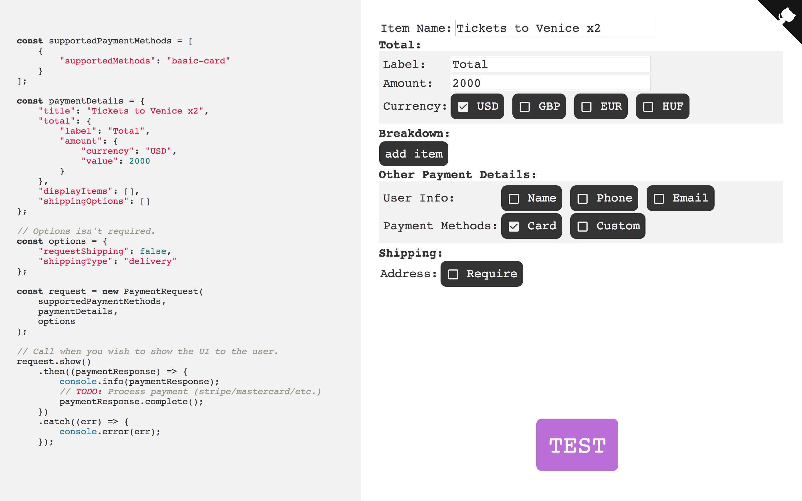

# PaymentRequest Generator
A UI for generating PaymentRequest code (https://paymentrequest.simmsreeve.com/)

[](https://www.codefactor.io/repository/github/isnit0/payment-request-generator)



## Future (See GH Issues)

## Developing
```bash
> brew install fswatch
> npm i -g browserify less

> npm i
> ./build.sh
> ./watch.sh
```

## See also
- [WebAudio Generator](https://webaudio.simmsreeve.com)

## Useful Links
- https://developers.google.com/web/fundamentals/payments/
- https://developer.mozilla.org/en-US/docs/Web/API/Payment_Request_API

## License
[MIT](./LICENSE)
